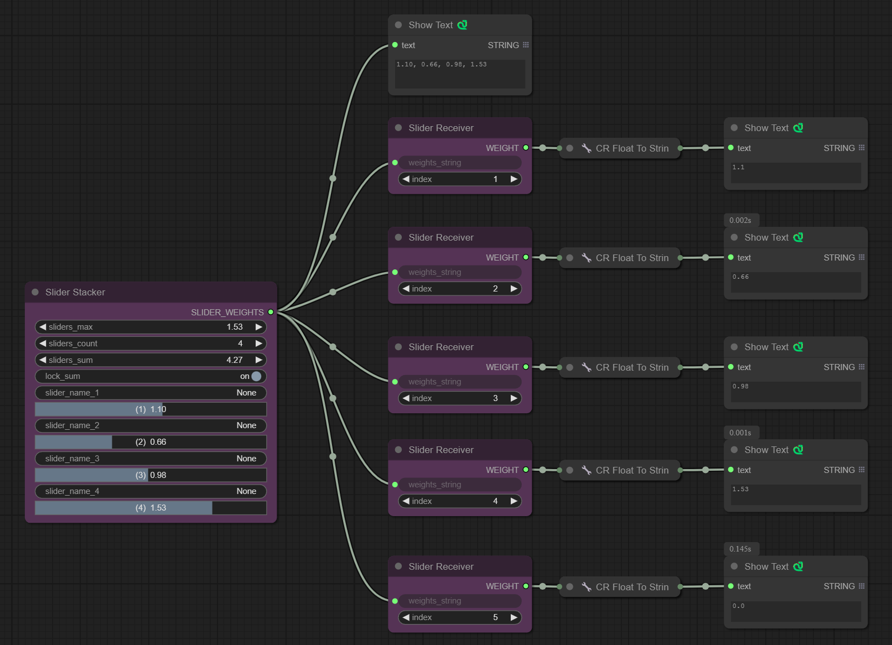

# Dynamic Sliders Stack for ComfyUI

<div align="center">
  
</div>

[](https://github.com/FunnyFinger/Dynamic_Sliders_stack/releases)
[](LICENSE)
[](https://github.com/FunnyFinger/Dynamic_Sliders_stack/issues)
[](https://github.com/FunnyFinger/Dynamic_Sliders_stack/pulls)
[](https://github.com/FunnyFinger/Dynamic_Sliders_stack/stargazers)

---

A custom node pack for **ComfyUI** providing a stack of named sliders with dynamic behavior.

---

##  Workflow

- An Example workflow is attached with the following image, just drag and drop this image in ComfyUI Canvas:

<div align="center">
  
</div>

---
## 🎥 Demo

### Contextual Features
- **Average Contextual Adjustment**  
  Dynamically adjusts all sliders to their average value using the context menu option. This feature is helpful for balancing all sliders evenly without manual adjustments.  
  <div align="center">
    
  </div>

- **Maximum Contextual Adjustment**  
  Sets all sliders to the maximum slider value using the context menu option. This ensures that all sliders are at their highest weight for uniform maximum intensity.  
  <div align="center">
    
  </div>

- **Minimum Contextual Adjustment**  
  Adjusts all sliders to the minimum slider value using the context menu option. This is useful for resetting sliders to their lowest intensity.  
  <div align="center">
    
  </div>

- **Context Reset**  
  Resets all sliders to their default values (e.g., 1.0). This feature helps quickly return to baseline settings for all sliders.  
  <div align="center">
    
  </div>

### Sum Lock Toggle and Sliders Sum Widget
- **Sliders with Lock Sum On**  
  Demonstrates how the sum lock feature maintains a constant total sum of sliders while allowing individual adjustments. It ensures that the overall weight does not exceed or drop below a set total.  
  <div align="center">
    
  </div>

- **Sliders Max with Lock Sum Off**  
  Allows sliders to be adjusted proportionally to their maximum value without maintaining the sum lock. This is ideal for scenarios where the total weight does not need to be constrained, but you wish to control the highest value while maintaining proportionality between sliders. This has an overall scaling effect that scales the sliders with respect to the minimum (zero).  
  <div align="center">
    
  </div>

- **Sliders Max with Lock Sum On**  
  Demonstrates how the sum lock can be maintained while adjusting the highest value slider. This ensures all sliders are proportionally scaled with respect to their average without exceeding the allowed total sum.  
  <div align="center">
    
  </div>

- **Sliders Sum with Lock Sum Off**  
  Highlights how sliders can be adjusted freely without sum constraints while dynamically displaying the total sum. This is useful for adjusting the sliders as a whole without changing their offsets.  
  <div align="center">
    
  </div>

---

## 📌 Nodes Overview

### Slider Stacker

- **Inputs**:
  - `sliders_max` (FLOAT): The master maximum value. Adjusting this scales all sliders below it.
  - `slider_count` (INT): Controls how many slider rows are visible and processed (1–50).
  - `slider_name_{i}` (STRING): A text field to name or describe the slider (optional).
  - `({i})` (FLOAT Widget): The individual weight for this slider (0.0–2.0). Adjusting this updates the `sliders_max` if this slider becomes the new maximum.
  - `sliders_sum` (FLOAT): Adjust this to change the total sum of all sliders *while preserving their relative differences* (when Sum Lock is off). Also displays the current sum.
  - **Sum Lock Toggle**: A toggle to lock the total sum of all slider values. When enabled, adjusting one slider redistributes the difference proportionally across the other sliders to maintain the locked sum. When enabled, the `sliders_sum` field becomes read-only.

- **Output**:
  - `SLIDER_WEIGHTS` (STRING): A comma-separated string of the weight values for sliders 1 through `slider_count`, formatted to two decimal places (e.g., "1.00, 0.50, 0.75").

- **Right-Click Options**:
  - `Average Slider Values`: Sets all visible sliders to their average value.
  - `Reset Slider Values`: Resets all visible sliders to the default value (1.0).
  - `Set All to Max Value`: Finds the highest value among visible sliders and sets all visible sliders to that value.
  - `Set All to Min Value`: Finds the lowest value among visible sliders and sets all visible sliders to that value.

---

### Slider Receiver

- **Inputs**:
  - `weights_string` (STRING): Connect the `SLIDER_WEIGHTS` output from the `Slider Stacker` here.
  - `index` (INT): The 1-based index of the slider whose weight you want to extract (1–50).

- **Output**:
  - `WEIGHT` (FLOAT): The floating-point value of the slider at the specified index (returns 0.0 if the index is out of bounds or input is invalid).

---

## 📦 Installation Methods

Choose any method that suits your setup:

### ✅ Method 1: Via ComfyUI Manager (Recommended)

1. Open ComfyUI.
2. Click on the **Manager** tab (top bar).
3. Go to **Install Custom Nodes**.
4. Paste this URL into the install field:

   ```
   https://github.com/FunnyFinger/Dynamic_Sliders_stack.git
   ```

5. Click **Install**.
6. Restart ComfyUI.

---

### 🧰 Method 2: Manual Git Clone

```bash
cd YOUR_COMFYUI_PATH/custom_nodes
git clone https://github.com/FunnyFinger/Dynamic_Sliders_stack.git
```

Then restart ComfyUI.

---

### 📁 Method 3: Manual ZIP Download

1. Go to the GitHub repo: [Dynamic Sliders Stack](https://github.com/FunnyFinger/Dynamic_Sliders_stack).
2. Click the green **Code** button → **Download ZIP**.
3. Extract the ZIP file.
4. Move the extracted folder into your ComfyUI `custom_nodes/` directory.
5. Restart ComfyUI.

---

## 🚀 Usage Instructions

1. **Add the Nodes:** Double-click on the ComfyUI canvas or right-click -> "Add Node". Search for "Slider Stacker" or "Slider Receiver". You can also find them under the "Dynamic Sliders Stack" category.
2. Add the **Sliders Stacker** node to your graph.
3. Set the `slider_count` field (e.g., 5 sliders).
4. Adjust the maximum value for the highest value slider via `sliders_max` and all sliders will adjust proportionally.
5. Adjust the target total sum value for all sliders via `sliders_sum` and all sliders will adjust accordingly while maintaining their offsets (only effective when Sum Lock is off).
6. Optionally set individual titles for each slider.
7. Adjust the sliders as needed in many modes: individually, proportionally (via `sliders_max`), offset (via `sliders_sum` with lock off), sliders_sum with sum-lock mode, individually with sum-lock mode.
8. Connect the `SLIDER_WEIGHTS` output port to the **Sliders Receiver** node (add this node the same way as the Stacker) and set the index to the required slider number.
9. Combine this custom node with other custom nodes like prompt composer to give controllable weight for parts of your prompt.
10. Right-click the **Slider Stacker** node for utilities such as Average All, Reset All, Max All and Min All.

---
## 🎯 Contributing

We welcome contributions! If you have suggestions for improvements or new features, please [open an issue](https://github.com/FunnyFinger/Dynamic_Sliders_stack/issues) or [submit a pull request](https://github.com/FunnyFinger/Dynamic_Sliders_stack/pulls).

---

## 📜 License

This project is licensed under the [MIT License](LICENSE).

---

Made with ❤️ by [FunnyFinger](https://github.com/FunnyFinger)
